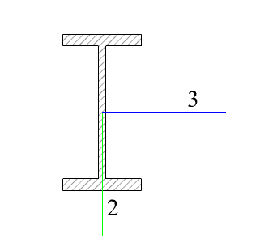

# MoziFESection.jl

This is a part of Project Mozi

This package provides convenient calculation of section properties of the project.

本包提供常见截面的几何形状属性计算。

## 技术笔记

### 1. 坐标系统定义

### 2. 有效抗剪面积的近似计算

腹板:
$
A_s=\frac{5}{6}bh
$

圆形截面
$
A_s=0.9\frac{\pi d^2}{4}
$

圆管截面
$
A_s=0.5 \pi t(d-t)
$

### 3. 扭转惯性矩的近似计算
（1）单室闭口截面薄壁截面
$
J=\frac{\Omega^2}{\oint\frac{1}{t}\text{d}s}
$
其中$\Omega$为薄壁中线围合面积的2倍，$\text{d}s$为薄壁路径微分，$t$为壁厚

（2）矩形截面板件

扭转刚度采用薄膜比拟，默认取30阶，即$n=30$：
$
J=\sum_{i=1}^n\frac{1}{(1+2^n)^5}\tanh\frac{\pi (1+2^n)h}{2b}
$